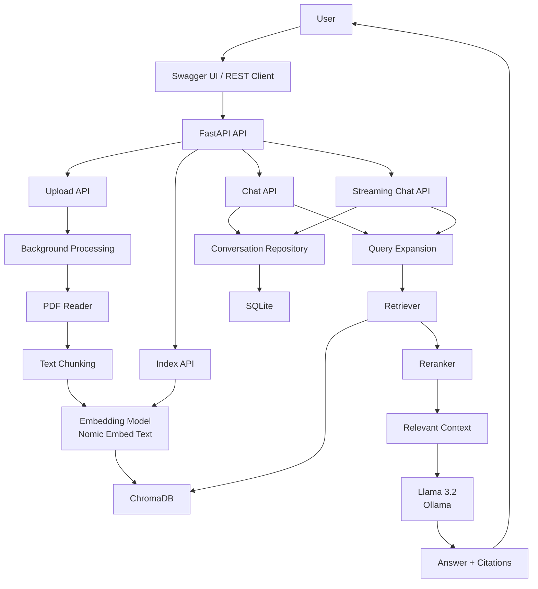
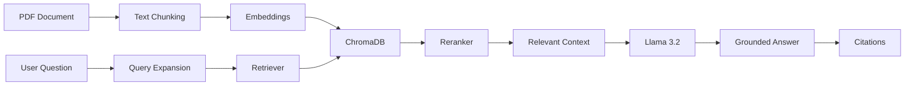

# 🤖 AI Document Chat API

An **enterprise-grade Retrieval-Augmented Generation (RAG)** application that allows users to upload PDF documents, index their contents, and chat with them using a **local Large Language Model (LLM)** powered by **Ollama**.

Built with **FastAPI, LangChain, ChromaDB, Docker, Docker Compose, and GitHub Actions**, following production-oriented engineering practices.


[](https://github.com/manojkr-ai-labs/ai-document-chat-rag/actions/workflows/test.yml)


---

# ✅ Project Status

**Project 2 — COMPLETE**

- ✅ Production-like Docker deployment verified
- ✅ Dockerized
- ✅ Docker Compose
- ✅ Production Compose configuration
- ✅ GitHub Actions CI
- ✅ Unit and API tests
- ✅ RAG pipeline
- ✅ Query expansion
- ✅ Reranking
- ✅ Retrieval evaluation
- ✅ RAG evaluation
- ✅ Reranker evaluation
- ✅ Local LLM with Ollama
- ✅ Local embeddings
- ✅ Background document processing
- ✅ Source citations
- ✅ Streaming chat
- ✅ Persistent conversation history
- ✅ Conversation CRUD APIs
- ✅ Persistent streaming history
- ✅ Health monitoring
- ✅ Global exception handling
- ✅ Structured logging
- ✅ End-to-end Docker verification

---

# 🎥 Demo

### Swagger UI

```text
http://localhost:8000/docs
```

### Health API

```text
http://localhost:8000/health
```

### OpenAPI

```text
http://localhost:8000/openapi.json
```

---

# 📸 Screenshots

| Swagger | Upload |
|---|---|
|  |  |

| Index | Chat |
|---|---|
|  |  |

| Health | Docker Compose |
|---|---|
|  |  |

| GitHub Actions | Folder Structure |
|---|---|
|  |  |

### Next.js UI

The Next.js UI is planned as a future enhancement.


---

# 🚀 Features

## Document Processing

- 📄 PDF upload
- 📚 Background document processing
- ✂️ Intelligent text chunking
- 🧠 Local embeddings
- 💾 ChromaDB vector storage

## RAG

- 🔍 Semantic retrieval
- 🔄 Query expansion
- 🎯 Reranking
- ⚖️ Relevance filtering
- 📖 Source citations
- 🤖 Grounded answer generation with Llama 3.2

## Chat

- 💬 Chat with indexed documents
- 🌊 Streaming responses
- 🧵 Persistent conversation history
- 📝 Conversation titles and previews
- 🔧 Conversation CRUD

## Engineering

- ❤️ Health monitoring
- 📝 Structured logging
- ⚠️ Global exception handling
- 🧪 Automated testing
- 🔄 GitHub Actions CI
- 🐳 Docker
- 🐳 Docker Compose
- 🏭 Production-like Compose configuration

---

# 🏗 System Architecture



---

# 🔄 RAG Pipeline



---

# 🧵 Conversation Architecture

```text
User Question
      ↓
Conversation Service
      ↓
Persist User Message
      ↓
RAG Retrieval
      ↓
LLM Generation
      ↓
Persist Assistant Message
      ↓
Return Answer + Citations
```

Supported operations:

- Create conversation
- List conversations
- Retrieve conversation
- Rename conversation
- Delete conversation
- Persist user messages
- Persist assistant messages
- Persistent streaming conversations

---

# 🛠 Tech Stack

| Area | Technologies |
|---|---|
| Backend | Python 3.12, FastAPI, Uvicorn |
| AI / RAG | LangChain, Ollama, Llama 3.2, Nomic Embed Text, ChromaDB, PyPDFLoader |
| Persistence | SQLite, ChromaDB |
| Testing | Pytest, Pytest-Cov |
| DevOps | Docker, Docker Compose, GitHub Actions |

---

# 📁 Project Structure

```text
project-02-ai-document-chat/
│
├── src/
│   ├── api/
│   ├── chunking/
│   ├── config/
│   ├── embeddings/
│   ├── exceptions/
│   ├── health/
│   ├── prompts/
│   ├── readers/
│   ├── retriever/
│   ├── services/
│   ├── utils/
│   └── vectorstore/
│
├── documents/
├── storage/
├── logs/
├── screenshots/
├── tests/
├── Dockerfile
├── docker-compose.yml
├── docker-compose.prod.yml
├── requirements.txt
├── .env.example
├── .gitignore
└── README.md
```

> `storage/` contains runtime data and is intentionally excluded from Git.

---

# ⚙️ Environment Variables

Copy `.env.example` to `.env`.

### Local development

```properties
LLM_MODEL=llama3.2:latest
EMBEDDING_MODEL=nomic-embed-text:latest
BASE_URL=http://localhost:11434
CHROMA_DIR=storage/chroma
CHROMA_PATH=storage/chroma
DOCUMENTS_PATH=documents
TOP_K=5
RELEVANCE_THRESHOLD=1.0
EMBED_BATCH_SIZE=100
LOG_LEVEL=INFO
```

### Production-like Docker

The production Compose configuration overrides the Ollama URL because `localhost` inside a container refers to the container itself:

```text
BASE_URL=http://host.docker.internal:11434
```

> Do not commit `.env`.

---

# 🦙 Ollama Setup

Required models:

```bash
ollama pull llama3.2
ollama pull nomic-embed-text
```

Verify:

```bash
ollama list
```

---

# ▶️ Local Setup

```bash
git clone https://github.com/manojkr-ai-labs/ai-document-chat-rag.git
cd ai-document-chat-rag
python -m venv venv
```

### Windows

```powershell
venv\Scripts\activate
```

### Linux / macOS

```bash
source venv/bin/activate
```

Install dependencies:

```bash
pip install -r requirements.txt
```

Configure environment:

```bash
cp .env.example .env
```

Windows PowerShell:

```powershell
Copy-Item .env.example .env
```

Start Ollama:

```bash
ollama serve
```

Start the API:

```bash
uvicorn src.api.app:app --reload --host 0.0.0.0 --port 8000
```

Open:

```text
http://localhost:8000/docs
```

---

# 🐳 Docker

## Build

```bash
docker build -t ai-document-chat .
```

## Run

```bash
docker run -p 8000:8000 ai-document-chat
```

For host Ollama connectivity, prefer the production-like Compose configuration below.

---

# 🐳 Docker Compose — Development

Start:

```bash
docker compose up --build
```

Stop:

```bash
docker compose down
```

The development configuration supports source-code mounting and reload mode.

---

# 🏭 Production-Like Docker Deployment

Use the separate `docker-compose.prod.yml` configuration.

Build and start:

```bash
docker compose -f docker-compose.prod.yml up -d --build
```

Check status:

```bash
docker compose -f docker-compose.prod.yml ps
```

View logs:

```bash
docker compose -f docker-compose.prod.yml logs -f
```

Stop:

```bash
docker compose -f docker-compose.prod.yml down
```

The production-like configuration provides:

- No source-code bind mount
- No `--reload`
- Persistent documents
- Persistent application storage
- Persistent logs
- Restart policy
- Container health check
- Dedicated Docker network
- Host Ollama connectivity

---

# 🏥 Health Check

```bash
curl http://localhost:8000/health
```

A healthy deployment should return HTTP `200`.

---

# 📚 API Endpoints

| Method | Endpoint | Description |
|---|---|---|
| GET | `/health` | Health check |
| POST | `/upload` | Upload PDF |
| GET | `/tasks/{task_id}` | Background task status |
| POST | `/index` | Index documents |
| POST | `/chat` | Chat with documents |
| POST | `/chat/stream` | Streaming chat |
| GET | `/conversations` | List conversations |
| POST | `/conversations` | Create conversation |
| GET | `/conversations/{conversation_id}` | Get conversation |
| PATCH | `/conversations/{conversation_id}` | Rename conversation |
| DELETE | `/conversations/{conversation_id}` | Delete conversation |

Interactive API documentation:

```text
http://localhost:8000/docs
```

---

# 📄 Document Upload Workflow

```text
Upload PDF
    ↓
Background Processing
    ↓
PDF Extraction
    ↓
Text Chunking
    ↓
Embedding Generation
    ↓
ChromaDB Indexing
    ↓
Task Completed
```

Example:

```bash
curl -X POST \
  -F "file=@documents/example.pdf" \
  http://localhost:8000/upload
```

Check the returned task:

```bash
curl http://localhost:8000/tasks/{task_id}
```

Index documents:

```bash
curl -X POST http://localhost:8000/index
```

---

# 💬 Chat Workflow

```bash
curl -X POST \
  -H "Content-Type: application/json" \
  -d '{"question":"What is the maximum marks for the examination?"}' \
  http://localhost:8000/chat
```

The response contains the conversation ID, title, answer, citations, and execution time.

---

# 🌊 Streaming Chat

```text
POST /chat/stream
```

The endpoint streams the generated response and returns the conversation identifier through:

```text
X-Conversation-ID
```

An existing `conversation_id` can be supplied to continue a conversation.

---

# 🧪 Running Tests

Run all tests:

```bash
pytest -q
```

Coverage:

```bash
pytest --cov=src --cov-report=term-missing
```

Latest full regression verification:

```text
83 passed
1 warning
```

The remaining warning is an upstream deprecation warning related to the `langchain-community` transition around `PyPDFLoader`. It is currently treated as a known dependency warning rather than changing document extraction solely to remove the warning.

---

# 🔄 Continuous Integration

GitHub Actions automatically performs the project's test workflow.

```text
Push
  ↓
GitHub Actions
  ↓
Install Dependencies
  ↓
Run Tests
  ↓
Coverage / Verification
```

---

# 🔍 End-to-End Verification

The production-like Docker deployment was verified through:

```text
Start Production Docker Container
          ↓
Container Health Check
          ↓
GET /health
          ↓
Upload PDF
          ↓
Check Task Status
          ↓
Index Document
          ↓
POST /chat
          ↓
Retrieve Relevant Documents
          ↓
Generate RAG Answer
          ↓
Return Citations
          ↓
Persist Conversation
          ↓
POST /chat/stream
          ↓
Verify X-Conversation-ID
          ↓
Retrieve Persistent Conversation
```

Verified example question:

```text
What is the maximum marks for the BCS-011 examination?
```

Verified answer:

```text
The maximum marks for the BCS-011 examination is 100.
```

Streaming chat was also verified successfully with HTTP `200` and the existing conversation ID.

---

# 📈 Version History

| Version | Feature |
|---|---|
| v1.x | Core RAG |
| v2.0 | FastAPI Foundation |
| v2.5 | Background Indexing |
| v2.9 | API Testing |
| v2.12 | GitHub Actions |
| v2.13 | Docker |
| v2.14 | Docker Compose |
| v2.15 | Production Ready Backend |
| v4.1 | Retrieval Evaluation |
| v4.2 | Reranking and Tests |
| v4.3 | Query Expansion and RAG Evaluation |
| v4.4 | Production Dependency Cleanup |
| v5.0 | Persistent Chat, Production-like Docker Deployment and Project 2 Completion |

---

# 🛣 Roadmap

## ✅ Completed

- PDF Upload
- Document Indexing
- Text Chunking
- Embeddings
- ChromaDB
- Semantic Retrieval
- Query Expansion
- Reranking
- Retrieval Evaluation
- RAG Evaluation
- Reranker Evaluation
- RAG Pipeline
- Source Citations
- FastAPI
- Health Monitoring
- Background Tasks
- Production-oriented Logging
- Docker
- Docker Compose
- Production-like Docker Compose
- GitHub Actions
- Conversation History
- Conversation CRUD
- Streaming Responses
- Persistent Streaming History

## 🚀 Upcoming

- Next.js Chat UI
- AWS EC2 Deployment
- Nginx Reverse Proxy
- HTTPS + Domain
- User Authentication
- Multi-user Support
- AI Agents
- Advanced Observability
- Kubernetes
- Redis
- PostgreSQL

---

# 🎯 Learning Outcomes

This project demonstrates practical experience with:

- Retrieval-Augmented Generation (RAG)
- Semantic search
- Embeddings
- Vector databases
- Query expansion
- Reranking
- RAG evaluation
- Retrieval evaluation
- Citation generation
- FastAPI
- REST API design
- Streaming APIs
- Conversation persistence
- Service/repository architecture
- Local LLM deployment with Ollama
- Docker
- Docker Compose
- Production-oriented configuration
- GitHub Actions CI
- Automated testing
- Structured logging
- Error handling
- Health checks

---

# 🧠 Engineering Approach

```text
Concept
   ↓
Architecture
   ↓
Implementation
   ↓
Testing
   ↓
Debugging
   ↓
Evaluation
   ↓
Production Hardening
   ↓
Docker Deployment
   ↓
End-to-End Verification
   ↓
Git Commit
   ↓
Release Tag
```

The objective is to build not only an AI prototype, but a maintainable backend demonstrating practical AI and software engineering skills.

---

# 📚 Example Questions

```text
What is NDSAP?

Explain version history.

Who implemented this policy?

When was version 2.4 released?

Who published this document?

What is the objective?

Explain data sharing.

Explain accessibility.

Summarize this document.
```

The RAG pipeline retrieves relevant document context and generates grounded answers with source citations.

---

# 🧩 AI Engineer Portfolio Roadmap

## Beginner

- Resume Reader
- PDF Chatbot
- Research Assistant

## Intermediate

- RAG
- Code Review Agent
- AI Security Auditor
- AI Meeting Assistant

## Advanced

- Multi-Agent Research Team
- AI Coding Assistant
- AI DevOps Engineer
- AI Government Knowledge Assistant

## Enterprise

- HR AI Agent
- Finance AI Agent
- Legal AI Agent
- Customer Support AI
- AI Workflow Automation

---

# 🏭 Production AI Roadmap

```text
Docker
   ↓
Kubernetes
   ↓
Redis
   ↓
FastAPI
   ↓
PostgreSQL
   ↓
Monitoring
   ↓
Deployment
   ↓
CI/CD
```

---

# 📦 Broader AI-Bootcamp Repository Structure

```text
AI-Bootcamp/
│
├── foundations/
│   ├── python
│   ├── prompt-engineering
│   ├── crewai-template
│   ├── langgraph-template
│   └── autogen-template
│
├── projects/
│   ├── beginner
│   ├── intermediate
│   ├── advanced
│   └── enterprise
│
├── interview/
├── revision/
├── architecture/
└── portfolio/
```

---

# 🙏 Acknowledgements

- FastAPI
- LangChain
- Ollama
- ChromaDB
- Docker
- GitHub Actions

---

# 📄 License

This project is licensed under the MIT License.

---

# 👨‍💻 Author

**Manoj**  
Software Engineer | AI Engineer

GitHub: https://github.com/manojkr-ai-labs

Portfolio: _Add your portfolio URL_

LinkedIn: _Add your LinkedIn URL_

---

# ⭐ Support

If you found this project useful, please consider giving it a ⭐ on GitHub.

---

# 🏆 Project 2 Completion

**AI Document Chat API — RAG**

**Status: COMPLETE ✅**

The project demonstrates an end-to-end RAG application covering:

```text
Document Upload
      ↓
Document Processing
      ↓
Chunking
      ↓
Embeddings
      ↓
Vector Search
      ↓
Query Expansion
      ↓
Reranking
      ↓
Relevant Context
      ↓
LLM Generation
      ↓
Citations
      ↓
Streaming Chat
      ↓
Persistent Conversations
      ↓
Docker Deployment
      ↓
End-to-End Verification
```

Release milestone:

```text
v5.0-project-2-complete
```
