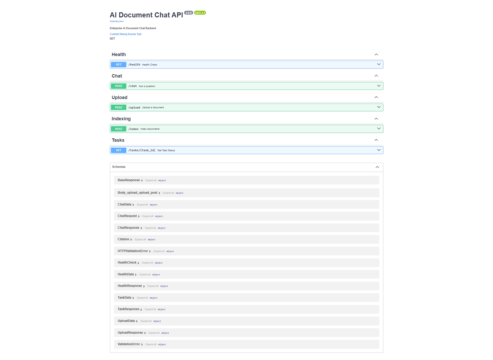
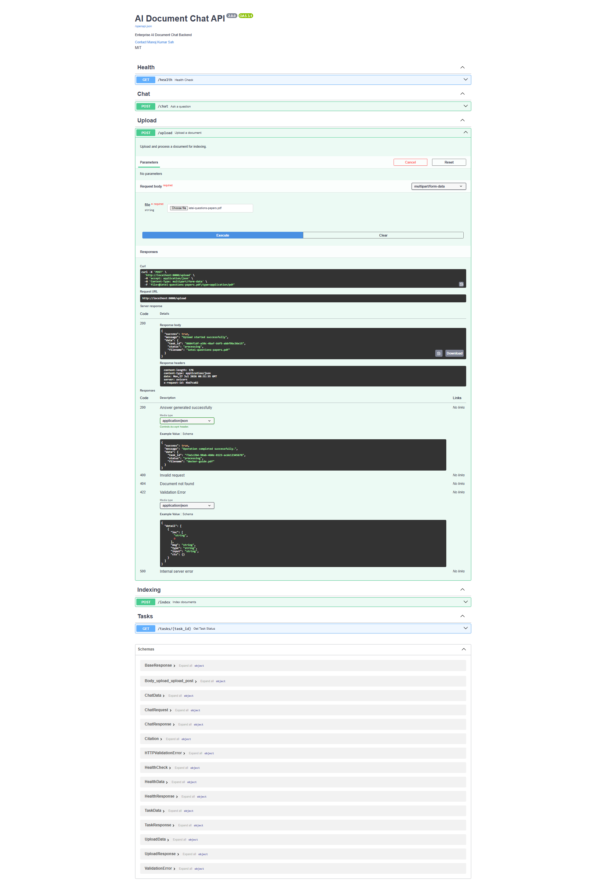
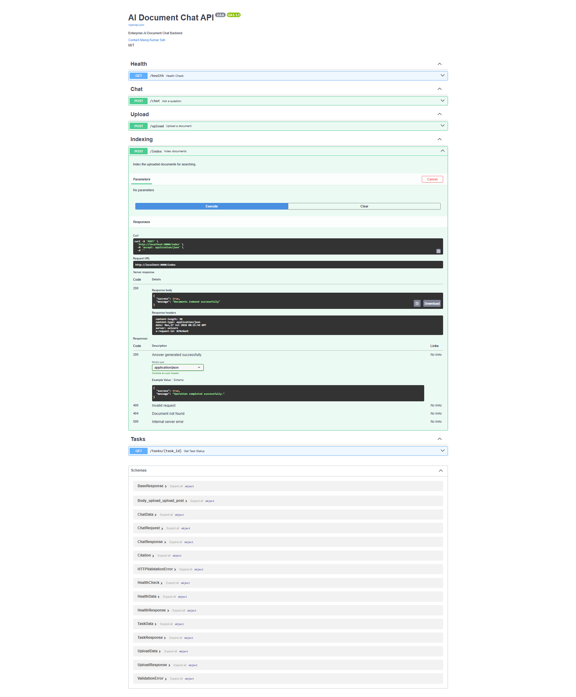
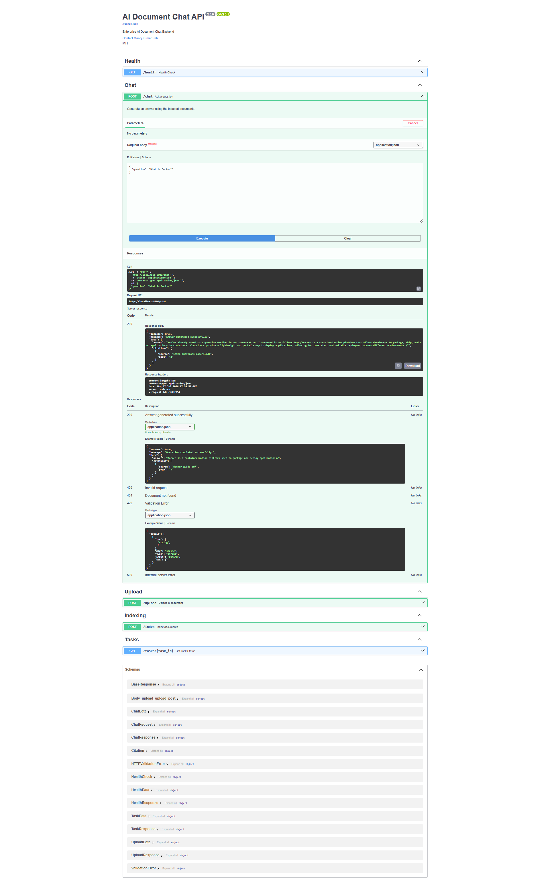
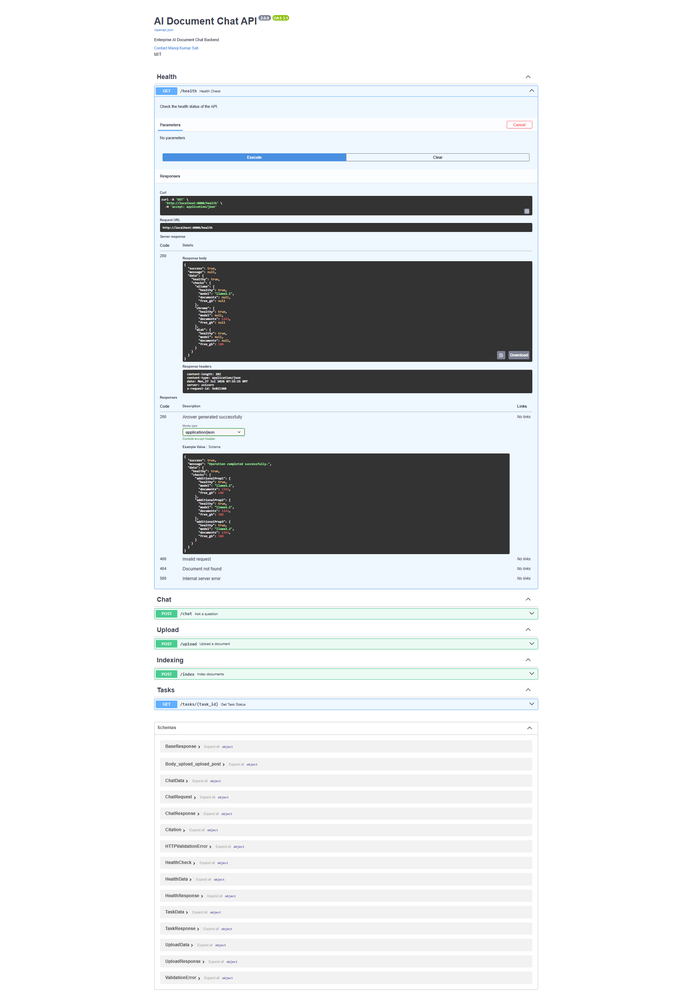
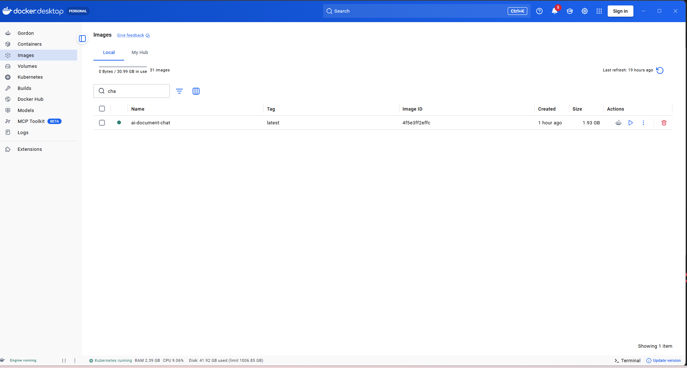
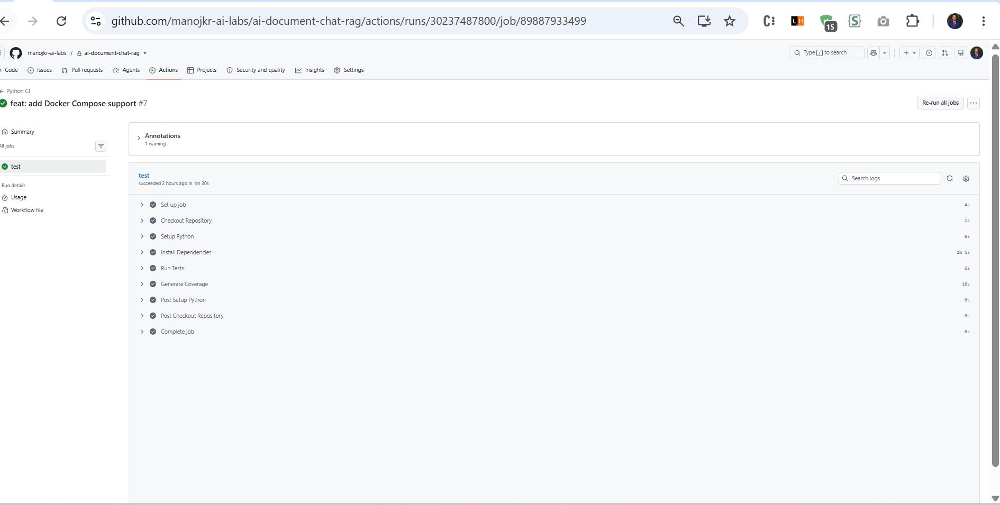
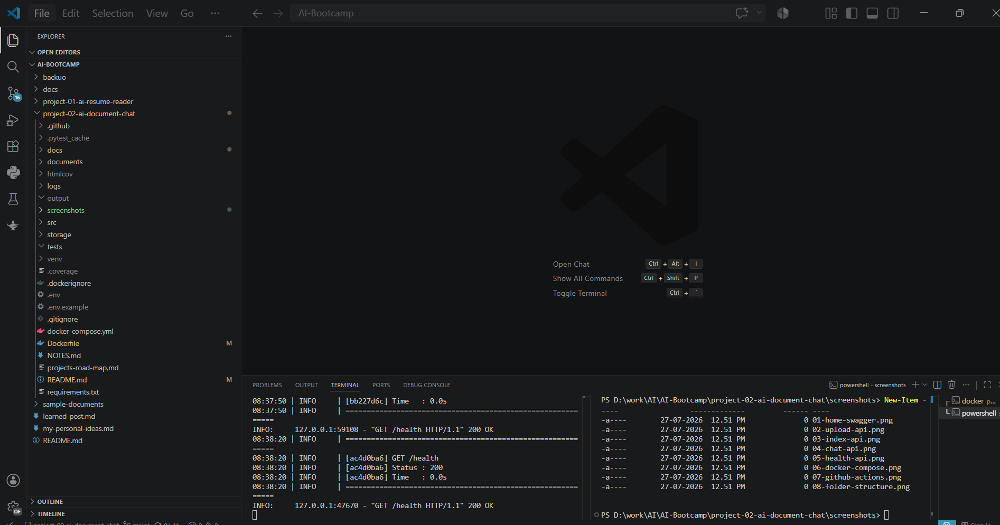
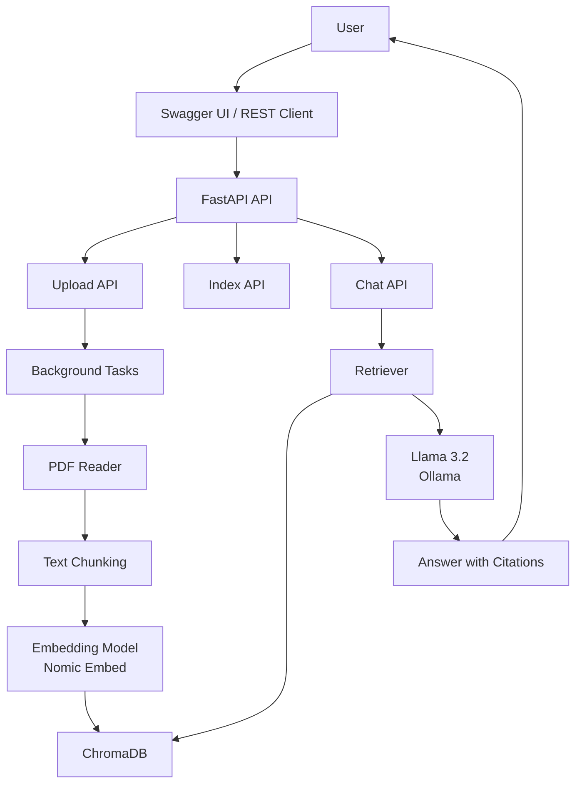
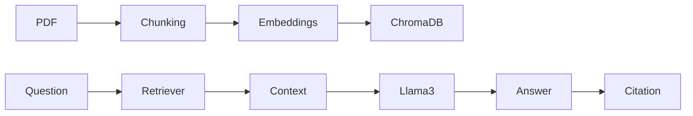

# 🤖 AI Document Chat API

An **enterprise-grade Retrieval-Augmented Generation (RAG)** application that allows users to upload PDF documents, index their contents, and chat with them using a **local Large Language Model (LLM)** powered by **Ollama**.

The project is built using **FastAPI, LangChain, ChromaDB, Docker, Docker Compose, and GitHub Actions**, following production-oriented software engineering practices.


[](https://github.com/manojkr-ai-labs/ai-document-chat-rag/actions/workflows/test.yml)


 


---

# ✅ Project Status

- ✅ Production Ready Backend
- ✅ Dockerized
- ✅ Docker Compose
- ✅ GitHub Actions CI
- ✅ Unit Tests
- ✅ RAG Pipeline
- ✅ Local LLM (Ollama)
- ✅ Production Logging
- ✅ Background Tasks
- ✅ Source Citations

---

# 🎥 Demo

### Swagger UI

```
http://localhost:8000/docs
```

### Health API

```
http://localhost:8000/health
```

---

# 📸 Screenshots

| Swagger | Upload |
|----------|--------|
|  |  |

| Index | Chat |
|------|------|
|  |  |

| Health | Docker Compose |
|---------|----------------|
|  |  |

| GitHub Actions | Folder Structure |
|----------------|------------------|
|  |  |

| Next.js UI (Upcoming) |
|------------------------|
|  |

---

# 🚀 Features

- 📄 Upload PDF Documents
- 📚 Automatic Document Indexing
- ✂️ Intelligent Text Chunking
- 🧠 Local Embeddings using Ollama
- 🔍 Semantic Search with ChromaDB
- 💬 Chat with Documents
- 📖 Source Citations
- ⚙️ Background Indexing
- ❤️ Health Monitoring API
- 📝 Structured Logging
- ⚠️ Global Exception Handling
- 🧪 Automated API Testing
- 🔄 GitHub Actions CI/CD
- 🐳 Docker Support
- 🐳 Docker Compose

---

# 🏗 System Architecture



---

# 🔄 RAG Pipeline



---

# 🛠 Tech Stack

## Backend

- Python 3.12
- FastAPI
- Uvicorn

## AI

- LangChain
- Ollama
- Llama 3.2
- Nomic Embed Text
- ChromaDB

## Testing

- Pytest
- Pytest-Cov

## DevOps

- Docker
- Docker Compose
- GitHub Actions

---

# 📁 Project Structure

```text
project-02-ai-document-chat
│
├── src
│   ├── api
│   ├── chunking
│   ├── config
│   ├── embeddings
│   ├── exceptions
│   ├── health
│   ├── prompts
│   ├── readers
│   ├── retriever
│   ├── services
│   ├── utils
│   ├── vectorstore
│   └── main.py
│
├── documents
├── storage
├── screenshots
├── output
├── tests
├── Dockerfile
├── docker-compose.yml
├── requirements.txt
├── .env.example
└── README.md
```

---

# ⚙️ Environment Variables

Copy the example file

```bash
cp .env.example .env
```

Example

```properties
LLM_MODEL=llama3.2:latest
EMBEDDING_MODEL=nomic-embed-text:latest
BASE_URL=http://host.docker.internal:11434
CHROMA_DIR=storage/chroma
LOG_LEVEL=INFO
```

---

# ▶️ Local Setup

Clone

```bash
git clone https://github.com/manojkr-ai-labs/ai-document-chat-rag.git
```

Move into project

```bash
cd ai-document-chat-rag
```

Create virtual environment

```bash
python -m venv venv
```

Activate

Windows

```bash
venv\Scripts\activate
```

Linux / macOS

```bash
source venv/bin/activate
```

Install dependencies

```bash
pip install -r requirements.txt
```

Run

```bash
uvicorn src.api.app:app --reload
```

Open

```
http://localhost:8000/docs
```

---

# 🐳 Docker

Build

```bash
docker build -t ai-document-chat .
```

Run

```bash
docker run -p 8000:8000 ai-document-chat
```

---

# 🐳 Docker Compose

Start

```bash
docker compose up
```

Stop

```bash
docker compose down
```

---

# 📚 API Endpoints

| Method | Endpoint | Description |
|---------|----------|-------------|
| GET | /health | Health Check |
| POST | /upload | Upload PDF |
| POST | /index | Index Documents |
| POST | /chat | Chat with Documents |
| GET | /tasks/{task_id} | Background Task Status |

---

# 🧪 Running Tests

Run all tests

```bash
pytest
```

Coverage

```bash
pytest --cov=src --cov-report=term-missing
```

---

# 🔄 Continuous Integration

GitHub Actions automatically performs:

- Install Dependencies
- Execute Unit Tests
- Generate Coverage Report

Workflow

```text
Push
   ↓
GitHub Actions
   ↓
Install Dependencies
   ↓
Run Tests
   ↓
Coverage Report
```

---

# 📚 What I Learned

- FastAPI production architecture
- Retrieval-Augmented Generation (RAG)
- LangChain pipelines
- ChromaDB vector search
- Ollama local LLM deployment
- Docker containerization
- Docker Compose orchestration
- GitHub Actions CI/CD
- API testing with Pytest
- Production logging and monitoring

---

# 📈 Version History

| Version | Feature |
|----------|---------|
| v1.x | Core RAG |
| v2.0 | FastAPI Foundation |
| v2.5 | Background Indexing |
| v2.9 | API Testing |
| v2.12 | GitHub Actions |
| v2.13 | Docker |
| v2.14 | Docker Compose |
| v2.15 | Production Ready |

---

# 🛣 Roadmap

## ✅ Completed

- PDF Upload
- Document Indexing
- Text Chunking
- Embeddings
- ChromaDB
- Semantic Retrieval
- RAG Pipeline
- Source Citations
- FastAPI
- Health Monitoring
- Background Tasks
- Production Logging
- Docker
- Docker Compose
- GitHub Actions

## 🚀 Upcoming

- Next.js Chat UI
- AWS EC2 Deployment
- Nginx Reverse Proxy
- HTTPS + Domain
- User Authentication
- Conversation History
- Streaming Responses
- Multi-user Support
- AI Agents

---

# 🎯 Learning Outcomes

This project demonstrates practical experience with:

- Retrieval-Augmented Generation (RAG)
- FastAPI
- LangChain
- ChromaDB
- Ollama
- REST API Design
- Docker
- Docker Compose
- CI/CD
- Automated Testing
- Production-ready Backend Development

---

# 🙏 Acknowledgements

- FastAPI
- LangChain
- Ollama
- ChromaDB
- Docker
- GitHub Actions

---

# 📄 License

This project is licensed under the MIT License.

---

# 👨‍💻 Author

**Manoj**

Software Engineer | AI Engineer

GitHub

https://github.com/manojkr-ai-labs

Portfolio

(Add your portfolio URL)

LinkedIn

(Add your LinkedIn URL)

---

# ⭐ Support

If you found this project useful, please consider giving it a ⭐ on GitHub.