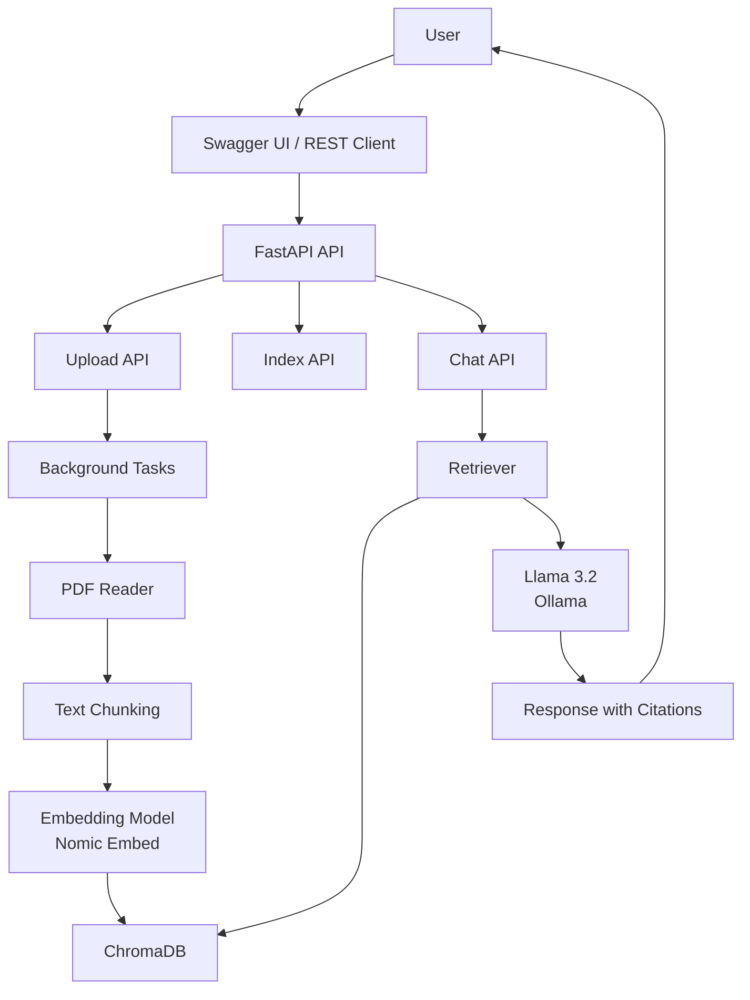

# 🏗 Architecture

```mermaid
flowchart TD

A[User]

B[Swagger UI / REST Client]

C[FastAPI API]

D[Upload API]

E[Index API]

F[Chat API]

G[Background Tasks]

H[PDF Reader]

I[Text Chunking]

J[Embedding Model<br/>Nomic Embed]

K[ChromaDB]

L[Retriever]

M[Llama 3.2<br/>Ollama]

N[Response with Citations]

A --> B
B --> C

C --> D
C --> E
C --> F

D --> G
G --> H
H --> I
I --> J
J --> K

F --> L
L --> K
L --> M

M --> N
N --> A
```